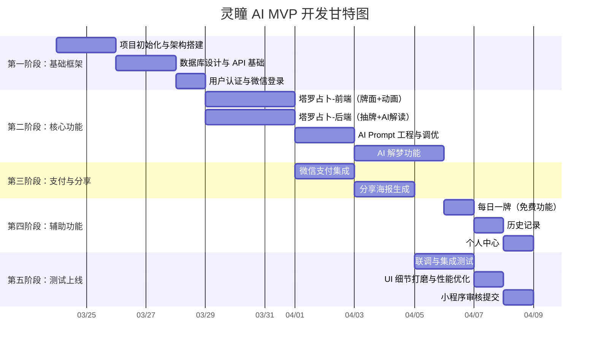

# 灵瞳 AI · 塔罗解梦小程序 — 开发计划与排期 v1.0

> **项目名称**：灵瞳 AI  
> **产品形态**：微信小程序  
> **目标版本**：MVP v1.0  
> **预计工期**：3 周（1人全栈）  
> **起始日期**：2026-03-24  
> **文档日期**：2026-03-24

---

## 一、开发阶段总览

---

## 二、分阶段详细任务

### 第一阶段：基础框架搭建（Day 1-5）

| # | 任务 | 优先级 | 预估工时 | 交付物 |
|---|------|--------|----------|--------|
| 1.1 | 小程序项目初始化（选型：原生 or uni-app） | P0 | 0.5d | 项目骨架代码 |
| 1.2 | 目录结构规划与代码规范制定 | P0 | 0.5d | 项目规范文档 |
| 1.3 | 全局样式系统（深紫+金色主题、字体、暗色模式） | P0 | 1d | `app.wxss` 及全局样式文件 |
| 1.4 | 数据库设计（用户表、订单表、记录表） | P0 | 1d | 数据库 Schema |
| 1.5 | 后端 API 服务搭建（Node.js/Python） | P0 | 1d | API 基础框架 |
| 1.6 | 微信登录与用户认证 | P0 | 1d | 登录流程闭环 |

**里程碑 ✅**：用户可通过微信授权登录小程序，服务端可正常响应请求。

---

### 第二阶段：核心功能开发（Day 6-13）

#### 2A. 塔罗占卜模块（5天）

| # | 任务 | 优先级 | 预估工时 | 交付物 |
|---|------|--------|----------|--------|
| 2.1 | 选择问题类型页面（感情/事业/学业/综合） | P0 | 0.5d | 问题选择页 |
| 2.2 | 困惑描述输入页（文本输入+字数限制） | P0 | 0.5d | 文本输入页 |
| 2.3 | 牌阵选择页面（单牌/三牌/五牌/十牌） | P0 | 0.5d | 牌阵选择页 |
| 2.4 | 塔罗牌面资源准备（78张牌面图+正逆位） | P0 | 1d | 牌面图片资源 |
| 2.5 | 洗牌动画 + 翻牌动画（3D 翻转效果） | P0 | 1.5d | 动画组件 |
| 2.6 | 后端抽牌逻辑（随机+正逆位+牌阵映射） | P0 | 0.5d | 抽牌 API |
| 2.7 | AI 解读 Prompt 模板设计与调优 | P0 | 1d | Prompt 模板集 |
| 2.8 | AI 解读接口对接（DeepSeek/通义千问） | P0 | 1d | 解读 API |
| 2.9 | 解读结果展示页（逐牌展示+综合建议） | P0 | 1d | 结果展示页 |

#### 2B. AI 解梦模块（3天）

| # | 任务 | 优先级 | 预估工时 | 交付物 |
|---|------|--------|----------|--------|
| 2.10 | 梦境描述输入页（文本输入） | P1 | 0.5d | 梦境输入页 |
| 2.11 | 解梦 Prompt 设计（荣格心理学角度） | P1 | 0.5d | 解梦 Prompt |
| 2.12 | 解梦 AI 接口对接 | P1 | 0.5d | 解梦 API |
| 2.13 | 解梦结果展示（象征物解析+整体分析） | P1 | 0.5d | 解梦结果页 |
| 2.14 | AI 输出敏感词过滤与合规检查 | P0 | 1d | 过滤中间件 |

**里程碑 ✅**：完成塔罗占卜全流程（选题→抽牌→翻牌→AI解读）和解梦全流程，AI 输出稳定可控。

---

### 第三阶段：支付与分享（Day 11-14）

> ⚠️ 与第二阶段后半程并行开发

| # | 任务 | 优先级 | 预估工时 | 交付物 |
|---|------|--------|----------|--------|
| 3.1 | 微信支付接口对接（统一下单 + 回调） | P0 | 1d | 支付 API |
| 3.2 | 订单系统（创建/查询/状态管理） | P0 | 1d | 订单模块 |
| 3.3 | 支付前拦截逻辑（免费次数判断+价格展示） | P0 | 0.5d | 支付拦截组件 |
| 3.4 | 分享海报模板设计（Canvas 绘制） | P0 | 1d | 海报模板 |
| 3.5 | 海报生成功能（牌面+解读摘要+小程序码） | P0 | 1d | 海报生成 API |
| 3.6 | 一键分享到朋友圈/群聊 | P0 | 0.5d | 分享功能 |

**里程碑 ✅**：付费占卜完整闭环（选择→付费→抽牌→解读→分享海报）。

---

### 第四阶段：辅助功能（Day 15-17）

| # | 任务 | 优先级 | 预估工时 | 交付物 |
|---|------|--------|----------|--------|
| 4.1 | 每日一牌功能（每日0点自动更新+寄语） | P1 | 0.5d | 每日一牌页 |
| 4.2 | 首页设计（星空背景+水晶球+功能入口） | P0 | 1d | 首页 |
| 4.3 | 历史占卜/解梦记录列表 | P1 | 0.5d | 记录列表页 |
| 4.4 | 记录详情查看（重新查看历史解读） | P1 | 0.5d | 记录详情页 |
| 4.5 | 个人中心（余额/使用次数/设置） | P1 | 0.5d | 个人中心页 |
| 4.6 | 免费次数管理逻辑（每日1次免费单牌） | P1 | 0.5d | 次数管理模块 |

**里程碑 ✅**：所有 MVP 功能开发完成，用户可完整体验全部功能。

---

### 第五阶段：测试与上线（Day 18-21）

| # | 任务 | 优先级 | 预估工时 | 交付物 |
|---|------|--------|----------|--------|
| 5.1 | 前后端联调 | P0 | 1d | 联调通过 |
| 5.2 | 功能集成测试（核心流程回归） | P0 | 1d | 测试报告 |
| 5.3 | UI 还原度检查与细节打磨 | P0 | 0.5d | UI 优化 |
| 5.4 | 性能优化（首屏加载、动画流畅度） | P1 | 0.5d | 性能报告 |
| 5.5 | 敏感词与合规终审 | P0 | 0.5d | 合规审核通过 |
| 5.6 | 小程序提交审核 + 上线 | P0 | 0.5d | 小程序上线 |

**里程碑 ✅**：小程序审核通过并正式上线。

---

## 三、数据库设计概要

### 核心数据表

| 表名 | 说明 | 核心字段 |
|------|------|----------|
| `users` | 用户表 | id, openid, nickname, avatar, free_count, created_at |
| `orders` | 订单表 | id, user_id, type(tarot/dream), amount, status, paid_at |
| `tarot_records` | 塔罗记录 | id, user_id, order_id, category, question, spread_type, cards(JSON), reading(TEXT), created_at |
| `dream_records` | 解梦记录 | id, user_id, order_id, dream_content, symbols(JSON), analysis(TEXT), created_at |
| `daily_card` | 每日一牌 | id, date, card_name, card_image, message, created_at |

---

## 四、API 接口规划

### 用户模块
| 方法 | 路径 | 说明 |
|------|------|------|
| POST | `/api/auth/login` | 微信登录 |
| GET | `/api/user/info` | 获取用户信息 |

### 塔罗占卜模块
| 方法 | 路径 | 说明 |
|------|------|------|
| POST | `/api/tarot/draw` | 抽牌 |
| POST | `/api/tarot/reading` | AI 解读 |
| GET | `/api/tarot/records` | 历史记录列表 |
| GET | `/api/tarot/records/:id` | 记录详情 |

### 解梦模块
| 方法 | 路径 | 说明 |
|------|------|------|
| POST | `/api/dream/analyze` | 解梦 |
| GET | `/api/dream/records` | 历史记录列表 |
| GET | `/api/dream/records/:id` | 记录详情 |

### 支付模块
| 方法 | 路径 | 说明 |
|------|------|------|
| POST | `/api/order/create` | 创建订单 |
| POST | `/api/order/pay` | 发起支付 |
| POST | `/api/order/callback` | 支付回调 |

### 其他
| 方法 | 路径 | 说明 |
|------|------|------|
| GET | `/api/daily-card` | 获取每日一牌 |
| POST | `/api/poster/generate` | 生成分享海报 |

---

## 五、技术选型确认

| 项 | 推荐方案 | 备选方案 | 决策依据 |
|----|----------|----------|----------|
| 前端框架 | **uni-app (Vue3)** | 微信原生 | 跨端复用可能，开发效率高 |
| 后端框架 | **Node.js (Express/Koa)** | Python Flask | JS 全栈一致性，生态成熟 |
| AI API | **DeepSeek API** | 通义千问 / GPT-4o-mini | 成本极低（¥0.02/次），中文能力强 |
| 数据库 | **MySQL** | MongoDB | 结构化数据为主，关系查询友好 |
| 部署 | **微信云开发** | 轻量云服务器 | 免运维，与小程序深度集成 |
| 海报生成 | **Canvas 2D API** | 服务端图片合成 | 客户端生成，减轻服务器压力 |

---

## 六、风险预案

| 风险项 | 概率 | 影响 | 预案 |
|--------|------|------|------|
| 小程序审核不通过（类目敏感） | 中 | 高 | 提前确认类目为"工具→生活服务"，文案规避"占卜/算命"，改用"心灵指引/自我探索" |
| AI 输出不合规内容 | 中 | 高 | Prompt 中严格约束 + 输出敏感词过滤 + 人工抽查 |
| 翻牌动画性能差 | 低 | 中 | 使用 CSS 3D Transform，降级方案为 2D 翻转 |
| DeepSeek API 调用超时 | 低 | 中 | 流式输出（SSE）+ 超时重试 + 备选模型切换 |
| 支付对账异常 | 低 | 高 | 完善订单状态机 + 异步对账 + 日志告警 |

---

## 七、后续迭代计划

### v1.1（上线后第 2-3 周）
- [ ] 五牌阵、十牌阵（凯尔特十字）
- [ ] 包月卡 ¥19.9/月
- [ ] 邀请好友奖励机制
- [ ] 语音输入梦境描述

### v1.2（上线后第 4-6 周）
- [ ] 星座运势模块
- [ ] 节日限定牌阵（情人节/水逆等）
- [ ] 数据埋点与分析面板
- [ ] 用户留存优化（推送提醒）

### v2.0（上线后第 7-10 周）
- [ ] 社区互动（匿名提问+解答）
- [ ] AI 情感顾问（对话式）
- [ ] 高级牌阵单独售卖
- [ ] 用户积分与等级系统

---

## 八、验收标准

### MVP 上线验收清单

- [ ] 微信登录正常
- [ ] 三牌阵塔罗占卜完整流程可用
- [ ] 翻牌动画流畅（≥30fps）
- [ ] AI 解读内容质量达标（≥300字，无敏感词）
- [ ] AI 解梦功能完整可用
- [ ] 每日一牌功能正常
- [ ] 微信支付正常（付费牌阵）
- [ ] 分享海报生成并带小程序码
- [ ] 历史记录可查看
- [ ] 首屏加载时间 ≤ 2 秒
- [ ] 无 JS 报错和白屏

---

> 📌 本文档随开发进度持续更新，所有变更记录在版本历史中。
