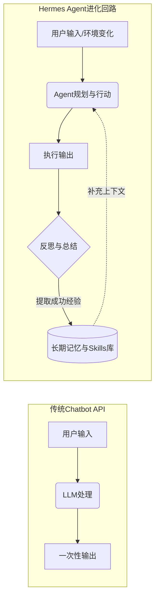

# 🤖 别再让你的 AI 裸奔：用 Hermes Agent 实现带"长期记忆"和"自我进化"的智能体

> 昨天你教了 AI 你的代码风格和项目结构，今天由于 Session 断掉，你发现它全都忘了。你一直在不厌其烦地“调教”，而它一直在无情地“初始化”。难道我们的 AI 只能是“阅后即焚”的复读机吗？

我们开发了那么多 AI 应用，对接了各式各样的 LLM API，甚至上了 RAG、接了向量数据库，却依然觉得 AI “很笨”—— 因为它们**缺少自进化的闭环与长达数月的任务状态记忆**。

今天，我们将介绍一款能给你的 AI 装上“海马体”的开源利器 —— **Hermes Agent (by Nous Research)**。

---

## 1️⃣ 什么是 Hermes Agent？(60秒速览概览)

Hermes Agent 不仅仅是一个聊天机器人的封装，它是由 Nous Research 开发的一个**基于持久化记忆系统与自学习循环的智能体框架**。

### 核心运作流比对

用一个简单的流程图来对比传统 API 调用与 Hermes Agent 的运作逻辑：



普通大模型是一个**开环系统**，而 Hermes 引入了**闭环思考 (Learning Loop)**。其中最重要的概念就是 **Skill（技能）**。当你或者 Agent 成功解决了一个难题，Hermes 会自动将这一过程“提纯”成可复用的说明书存起来；下一次遇到类似场景，直接读取记忆。

---

## 2️⃣ 横评：传统 RAG vs 传统 Chatbot vs Hermes Agent

为了更清晰地理解它的定位，我们通过一张表格进行对比：

| 评估维度 | 传统 Chatbot | 传统 RAG 系统 | Hermes Agent 记忆系统 |
| :--- | :--- | :--- | :--- |
| **持久记忆能力** | ❌ 依赖单次上下文窗口长度 | 🟡 检索文档不等于拥有行为习惯 | ✅ 拥有专属的长期图谱记录与技能书 |
| **自我经验积累** | ❌ 无法总结过去的交互经验 | ❌ 需要人工写 ETL 入库知识 | ✅ 自动在交互结束后提炼 **Skill 文档** |
| **复杂工具调度** | 🟡 只支持少量的 Function Call | 🟡 擅长信息读取，不擅长反思和执行 | ✅ 内置强悍的反思回路以调度数十种本地工具 |
| **系统心智模型** | 回答问题的“搜索引擎” | 辅助阅读的“图书馆管理员” | 与你共同成长的“数字协作者” |

---

## 3️⃣ 深度实战演练：从零部署专属的 Hermes

理论再好，不如拉起来跑一跑！目前 Hermes 提供了极其丝滑的开源部署体验。这里带你走一遍最为推荐的**快速启动方案**。

### 步骤一：克隆仓库与环境准备

确保你的机器上安装了 Python 3.10+ 和 Node.js。我们这里直接基于其开源核心版本开展：

```bash
# 克隆 Hermes Agent 相关工作流仓库
git clone https://github.com/NousResearch/Hermes-Function-Calling.git
cd Hermes-Function-Calling

# 建立虚拟环境并安装基础依赖
python3 -m venv venv
source venv/bin/activate
pip install -r requirements.txt
```

### 步骤二：配置大语言模型及后端记忆源

Hermes 本质上对模型是**解耦**的，最推荐对接本地微调的开源模型（如 Hermes 3 序列），或者直接代理至 OpenAI 兼容接口。我们这里以最简单的 `.env` 配置为例。

创建一件 `.env` 文件，输入以下信息：

```ini
# 选择你的大模型底座
MODEL_PROVIDER=openai
OPENAI_API_KEY=sk-your-api-key-here
LLM_MODEL=gpt-4o

# 配置记忆与状态存储（通常使用 SQLite 便于本地体验）
DB_TYPE=sqlite
DB_FILE=./hermes_memory.db
```

### 步骤三：初探“技能抽取”实战

接下来，让我们见证奇迹的时刻！运行启动脚本：

```bash
python hermes_agent_cli.py
```

在终端里向它发布一个任务：
> **你：**“以后凡是我要求你写 Flutter 代码，请务必帮我抽离 State，并按照我之前提到的 Riverpod 3.0 风格编写。”

```bash
[Hermes Agent 思考过程]: 
🕵️ 分析：用户提出了一个通用的代码规范偏好。
🛠️ 判断：这是一个需要记录到长期记忆以规范未来交互的指令。
✍️ 行动：[调用工具保存技能] -> Creating Skill `prefer_riverpod3_state`.
🗣️ 回复：没问题！我已经将这套标准写入了我的记忆库。下次生成 Flutter 代码时，我会默认使用 Riverpod 3.0 风格。
```

关闭这个 Terminal 窗口，**彻底杀掉进程**。

然后再重新打开终端，启动应用：

> **你：**“帮我写一个显示用户信息的 Flutter 页面。”

```bash
[Hermes Agent 思考过程]:
🔍 检索：匹配到技能 `prefer_riverpod3_state`。
✍️ 行动：根据 Riverpod 3.0 的规范输出 StateNotifierProvider 及相关代码结构...
```

**它记住了！而且完全跨越了 Session 的生命周期！**

---

## 4️⃣ 这个系统是如何做到自行构建技能的？

让我们揭开它背后的**魔法原理**，通过另一张表格直观对比它的技术链路：

| 执行层 | 行为逻辑 | 对应 Hermes 源码模块 |
| :--- | :--- | :--- |
| **短期推演层** | 在单次会话里规划、执行和反思 (ReAct 范式) | `AgentPlanner` |
| **元认知判定层** | 判断“对话是否结束？刚才是不是解决了一个新问题？” | `Metacognition_Module` |
| **记忆提取层** | 将经验浓缩成 Markdown 格式的准则，写入存储介质 | `SkillExtractor` (使用工具写入 DB) |
| **场景激活层** | 拿到新需求时，进行语义相似度搜索激活过去的规则 | `VectorDB_Retrieval` |

这套链路巧妙地利用了大模型自身的归纳能力：把“如何写代码”总结成了一份 **Skill Document（技能文档）**。

---

## 5️⃣ 最佳实践总结与建议

在引入类似 Hermes 这样的记忆体框架前，你要先评估一下业务场景是否真的需要。

✅ **什么时候应该上 Hermes 这类带自学习记忆的 Agent：**
- 个人定制化极强的助理应用（比如：记住你饮食喜好的私人旅行管家）
- 开发提效工具包，需要 AI 记住工程特定的领域规范和历史 Bug 排查路线
- 需要多步骤执行，且失败后需要自我纠错和总结的产品

❌ **什么时候用普通 LLM 接口就可以了：**
- 标准化流水线任务（比如：把整段英文机器翻译成中文，用一次扔一次）
- 确定的问答系统（例如直接查询企业内部百科）
- 成本极其敏感、要求请求延迟低于 500ms 的前台高并发场景

### 总结

> 普通的大模型是一种工具，用完即走；而具备了自我反思并能提取专属 Skill 的 Hermes，才是一个能与你共同成长的数字协作者。

当人工智能不再是单纯的“失忆复读机”，而是像树木一样具备时间刻度和成长印记，这才是 AI Agent 真正的魅力所在。

赶快拉取 [Nous Research 的 Hermes 仓库](https://github.com/NousResearch)，探索你的“具备生长能力的智能体”吧！

---
*📝 作者：NIHoa ｜ 系列：AI应用开发实战 ｜ 更新日期：2026-04-12*
