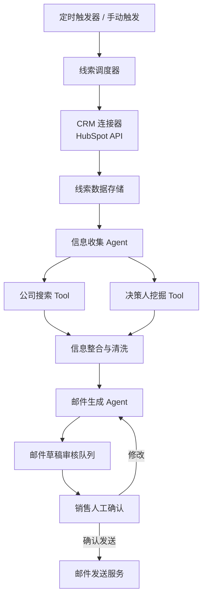

# 从 NanoBot 到你的第一个 Agent：一条被验证过的入门路径

> LangChain 文档翻了三章，LangGraph 教程看了两个，Function Calling 的定义也背熟了。真让你从零写一个 Agent，打开编辑器的那一刻，光标在第一行闪了 15 分钟，你还是不知道从哪下手。这不是笨——这是几乎所有 Agent 初学者都会遇到的「架构直觉缺失症」。

---

## 为什么你学 Agent 总感觉「学了一堆概念还是不会写」

先描述一个典型的 Agent 初学者路径，看看你是不是也这样：

1. 刷到一篇「Agent 入门」，知道了 ReAct 模式、Tool Use、规划-行动-观察循环
2. 跟着教程跑通了 LangGraph 的 Hello World——一个能调用计算器的 Demo
3. 去 GitHub 搜了几个高星 Agent 项目，clone 下来，改了改 Prompt，跑起来了
4. 然后呢？没然后了。让你从零设计一个 Agent，你脑子里只有零散的概念，拼不出完整的结构

问题出在哪？**你一直在学「Agent 的零件长什么样」，但从来没见过「一整辆车是怎么从零件拼起来的」。**

零件认识再多，没有架构直觉，你永远是在改别人的车，而不是自己造车。

这篇文章给你一条可操作的路径——不是空泛的「多看多写」，而是每一步都有具体工具、具体做法、具体判断标准的 4 步法：

```
选对入门项目 → AI 帮你拆架构 → 模拟作者写 Roadmap → 从真实需求造自己的项目
```

这条路径的核心目标不是让你尽快写出「能跑的代码」，而是让你尽快建立「我知道为什么这样设计」的**第一性原理认知**。

---

## 第一步：选对项目，比努力重要

学 Agent 的第一大忌，就是一上来啃 LangChain/LangGraph 官方 Examples，或者直接冲那种几万行代码的重型框架。

你需要的是一个**麻雀虽小、五脏俱全**的项目。满足三个标准：

| 标准 | 具体要求 | 为什么 |
|------|---------|--------|
| 代码量小 | 核心逻辑控制在 3000~5000 行以内 | 代码量过大你看不到全貌，容易陷入细节 |
| 高星且活跃 | GitHub Star 最好过千，近半年有提交 | 说明方案经过了社区验证，不是作者自娱自乐 |
| 单一聚焦 | 目标是做「个人助理类 Agent」，不是大而全的框架 | 聚焦一个场景才能看清设计决策的取舍 |

符合这个标准的项目并不多。我比较推荐的是 **NanoBot**：

- 仓库地址：<https://github.com/your-repo/nanobot>
- 定位：个人助理类 Agent 的最小可运行实现
- 特点：代码量小，但 Agent 的核心模块（规划、工具调用、记忆、对话管理）一个不缺

就像学操作系统你先看 XV6 而不是 Linux 内核，学编译器你先看 MiniJava 而不是 GCC——学 Agent，先从 NanoBot 这类「教学级完整实现」入手。

**然后你需要一个 Coding Agent 工具**。Codex、Cloud Code、Z Code、Open Code 都行，核心是支持「打开整个项目目录」并且能做跨文件理解。这个工具不是用来让它替你写代码的——是用来让它**替你读代码**的。

---

## 第二步：让 AI 帮你搭框架，建立架构直觉

这是整条路径最关键的一步，也是和传统学习方法最大的区别。

传统方法告诉你：clone 下来之后，从 `main.py` 开始读，一行一行啃。这没错，但效率极低。你花了三天读代码，最后记住的是「这个文件里有个函数叫 `run_loop`」，而不是「这个项目的架构是怎么分层的」。

**Vibe Coding 时代的方法是：让 AI 先把框架给你搭起来，你只要判断这个框架对不对。**

### 具体操作

```bash
git clone https://github.com/your-repo/nanobot.git
# 用你常用的 Coding Agent 打开这个目录
```

然后丢给它这样一段 Prompt：

> **【项目架构分析 Prompt】**
>
> 请你以「系统架构师」的视角，分析这个项目的整体设计。我需要的不是逐行代码讲解，而是一个**可以让我快速建立全局认知的框架**。
>
> 请按以下结构输出：
>
> 1. **一句话定位**：这个项目到底是做什么的，用一句话说清楚
> 2. **核心架构图**：用 mermaid 画出模块之间的关系和数据流（不要太细，5~8 个模块就够了）
> 3. **模块职责表**：每个模块负责什么、对外暴露什么接口、依赖哪些其他模块，用表格列出来
> 4. **核心运行流程**：从「用户发一条消息」到「Agent 给出最终回复」，中间经历了哪些关键步骤？用流程图 + 一句话说明每一步
> 5. **关键设计决策**：你认为这个项目里最值得注意的 2~3 个设计选择是什么（比如状态管理方式、工具调用机制、记忆存储策略），每种选择的 trade-off 是什么

你会发现，AI 用 5~10 分钟就能输出一个你自己读代码可能要三天才能总结出来的全局框架。

**而你要做的事只有一件：判断这个框架说的是不是人话。**

不需要你验证每个细节对不对，也不需要你逐行对照代码。你只需要问自己：

- 这个架构图的逻辑顺不顺？
- 模块之间的依赖关系合不合理？
- 核心运行流程有没有明显遗漏？

只要大框架是对的，**你的架构直觉就已经建立了 80%**。

这里有一个非常重要的心态调整：

> 你不需要面面俱到。你不需要知道每个函数的参数、每个类的继承关系。**你只需要一个框架。**

框架是什么？框架是「我知道这个项目大概分哪几层、每层干嘛、数据怎么流」。有了框架，之后你想深入某个细节时，知道该去哪个文件里找——这就够了。

没有框架的知识是散落的零件，有了框架的知识才是能开的车。

---

## 第三步：模拟作者视角，倒推构建 Roadmap

有了架构图之后，你知道了「这车长什么样」。但你还是不知道「这车是怎么一步步造出来的」。

这就是为什么你直接改别人的项目，面试的时候一深问就露馅——你知道最终的形态，但你不知道每一步设计决策背后的**为什么**。

解决方法：**让 AI 切换成「项目作者」的视角，给你倒推一个从 0 到 1 的构建 Roadmap。**

### 用这个 Prompt

> **【作者视角 Roadmap Prompt】**
>
> 假设你是这个项目（NanoBot）的第一作者，现在你要从零开始把它做出来。请你给我一个从 0 到 1 再到 100 的**分阶段构建 Roadmap**。
>
> 要求：
>
> 1. 分 4~6 个阶段，每个阶段有明确的目标和产出
> 2. 每个阶段只做「当下最必要的事」，不提前引入后续才需要的复杂度
> 3. 每个阶段结束后，项目应该是**可以独立运行并验证效果**的（哪怕功能很简陋）
> 4. 对每个阶段，要说明：
>    - 这个阶段的核心目标是什么
>    - 为什么要在这个阶段做这件事（而不是更早或更晚）
>    - 如果跳过这个阶段直接做后面的，会遇到什么问题
> 5. 阶段之间的递进关系要符合真实的开发逻辑，而不是「先写所有 Model，再写所有 Service」这种教科书式的划分

举个 NanoBot 可能长什么样的 Roadmap 例子（示意，不是实际内容）：

```
Phase 1：最小对话闭环
  目标：用户发消息 → LLM 回消息，没有 Agent 能力
  为什么先做：先搭好对话的输入输出管道，这是一切的基础
  跳过的后果：后面加 Agent 逻辑时不知道 bug 出在管道层还是逻辑层

Phase 2：引入工具调用
  目标：支持 1 个最简单的工具（比如获取当前时间），能正确触发并返回结果
  为什么第二个做：Tool Use 是 Agent 和 Chatbot 的核心分界线
  跳过的后果：后面加规划能力时没有「行动」这个落脚点

Phase 3：规划-行动-观察循环
  目标：加入 ReAct 模式，支持多步推理 + 多工具调用
  为什么第三个做：有了单工具调用的经验，再扩展到多步循环才顺
  跳过的后果：直接上多步会出现大量不可控的状态问题

Phase 4：短期对话记忆
  目标：支持多轮对话上下文，Agent 记得之前说过什么
  为什么第四个做：记忆是为复杂任务服务的，前面的循环跑通了才需要记忆
  跳过的后果：记忆的引入会掩盖很多规划逻辑的问题，增加调试难度

Phase 5：长期记忆 + 自我迭代
  目标：支持跨会话的知识存储和调取
  为什么最后做：长期记忆的设计选择高度依赖前面的架构
  跳过的后果：过早引入会导致架构频繁重构
```

### 拿到 Roadmap 之后怎么用

不要一路往下看。**看到每个阶段的目标后，先停下来问自己：**

> 如果是我，我会怎么设计这个阶段的实现？模块怎么拆？接口怎么定义？

想完了，再去看作者的实际代码，对比一下：

- 作者的设计和我的想法一样吗？
- 如果不一样，差异在哪？
- 作者为什么选择那样做？是有什么我没考虑到的约束吗？

**这个「先自己想，再对比」的过程，就是第一性原理认知的来源。**

你不再是「哦，原来这里是这样写的」的被动接收者，而是「原来这里的权衡是这样的」的主动思考者。前者只能改别人的代码，后者能写自己的代码。

---

## 第四步：别改别人的项目，从零构建你自己的

走完前三步，你已经把 NanoBot 这种项目吃透了。架构图在脑子里，Roadmap 也走过一遍了。

这时候大多数人的选择是：找一个 GitHub 上的 Agent 项目，改吧改吧，做成自己的作品集。

我不推荐这么做。

### 为什么「改别人的项目」是次优选择

别人已经完整写好的项目，有一个致命的问题：**所有的设计决策都已经做完了。**

你改 Prompt、换工具、调参数——你在做的都是「微调」，你从头到尾都没有面对过一个最核心的问题：**从零开始的时候，第一个文件该写什么？为什么先写这个而不是那个？模块边界怎么画？**

这些问题的答案，就是面试时面试官真正想听的东西。你改了 10 个开源项目，面试时被问到「你这个项目的状态管理为什么选 X 而不是 Y？」，你很可能只能说「因为原项目就是这么写的」——这是最差的回答。

### 更好的方法：从真实需求出发，从零构建

去找甲方平台上的 Agent 项目需求，比如 Upwork、Fiverr 这类。

为什么选这些平台，而不是国内招聘网站的 JD？因为这些平台上的需求是**甲方真的愿意付钱的需求**，描述通常非常具体：要做什么、解决什么问题、交付标准是什么——而不是国内招聘 JD 那种「熟悉大模型相关技术，有 Agent 项目经验」的空话。

### 具体操作

去 Upwork 上搜「AI Agent developer」「LLM agent build」「custom autonomous agent」这类关键词，找 5~10 个你觉得贴近企业真实场景的需求贴。然后把其中一个丢给大模型：

> **【需求驱动项目构建 Prompt】**
>
> 下面是一个甲方在 Upwork 上发布的 Agent 项目需求：
>
> （这里贴你选的需求原文）
>
> 请你帮我从 0 到 1 规划并构建这个项目。注意，我需要**完整的从零到一过程**，而不是直接给我最终代码。
>
> 请按以下步骤配合我：
>
> 1. **需求拆解**：把甲方的自然语言需求翻译成结构化的功能列表，区分「核心功能（必须有）」和「增强功能（可以后做）」
> 2. **技术选型建议**：基于需求推荐技术栈（后端框架、Agent 框架、向量库、部署方案等），并说明每个选择的理由和 trade-off
> 3. **架构设计**：画出系统架构图和模块职责表，说明模块之间的交互方式
> 4. **分阶段实施 Roadmap**：和之前一样，4~6 个阶段，每个阶段可独立运行
> 5. 然后我们从 Phase 1 开始，一步步实现

这样做的好处是：

1. **你是作者，不是修改者**。每一个设计决策都是你（在 AI 协助下）自己做的，你能讲清楚背后的为什么
2. **需求有约束**。真实的需求会迫使你做 trade-off，而不是「我想加什么功能就加什么」的玩具项目
3. **作品集有真实感**。面试时你可以说「这个项目的需求来自某个真实的甲方需求，我当时的考虑是……」，远比「这是我改的一个开源项目」有说服力

---

## 实战案例速览：一个 JD 怎么变成一个项目

为了让你有个直观感觉，我们走一遍前面的流程（只展示前两步，不展开完整实现）。

### 示例需求（改编自典型企业 Agent 需求场景）

> **【示例需求】**
> 我们是一家 B2B SaaS 公司，需要构建一个「销售线索助理 Agent」。它能做三件事：
> 1. 从我们的 CRM（HubSpot）里读取新的潜在客户数据
> 2. 自动去互联网搜索这家公司的最新动态、融资信息、关键决策人资料
> 3. 基于收集到的信息，生成一封个性化的销售跟进邮件草稿，交给销售审核后发送
>
> 预算：$3000~$5000，周期 2~3 周。

### Step 1：需求拆解

| 类别 | 功能点 | 说明 |
|------|--------|------|
| 核心 | CRM 数据读取 | 对接 HubSpot API，定时拉取新线索 |
| 核心 | 公司信息搜索 | 调用搜索引擎/商业数据库 API，获取公司动态 |
| 核心 | 决策人信息挖掘 | LinkedIn/Crunchbase 等平台查找关键联系人 |
| 核心 | 个性化邮件生成 | 基于收集的信息 + 邮件模板生成草稿 |
| 增强 | 邮件效果追踪 | 统计打开率、回复率，反哺后续生成策略 |
| 增强 | 多渠道分发 | 除了邮件，也生成 LinkedIn 消息、WhatsApp 文案等 |

### Step 2：架构设计草图



到这一步，项目的骨架已经出来了。接下来就是 Phase 1 Phase 2 一步步实现的事。

注意：这个阶段你完全不用写任何代码。**先把需求拆解和架构图想清楚，再动手写代码——这是从零构建项目和改别人项目的最大区别。**

---

## 这条 4 步法，为什么有效

最后，我们抽离出这条路径的底层逻辑。它之所以比「看文档 → 改项目」的传统路径更有效，是因为它做对了三件事：

### 1. 架构直觉先于代码细节

传统学习路径是「零件 → 整车」：先学每个 API 怎么用，最后拼起来。但人理解复杂系统的方式恰恰相反——先有一个模糊的全貌，再往里面填充细节。

先用 AI 帮你拿到框架，你所有后续的学习都是在**往一个已有架子上挂东西**，而不是在黑暗中摸索。

### 2. 逆向工程 + 正向构建，双向验证

```
逆向工程（拆 NanoBot）：
  成品 → 架构 → Roadmap → 每个阶段的设计决策

正向构建（写自己的项目）：
  需求 → 架构 → Roadmap → 每个阶段的设计决策
```

你拆过一个完整项目，知道别人的决策长什么样；再自己从零做一遍，知道自己的决策会遇到什么问题。这两条路径交叉验证之后，你对 Agent 设计的理解就不再是「我看过这个概念」，而是「我做过这个决策」。

### 3. 真实需求是最好的约束

很多初学者的 Agent 项目做着做着就变成了功能堆砌——因为没有真实的需求约束，你不知道什么该做、什么不该做。

甲方 JD 天然带有约束：预算有限、时间有限、功能有明确优先级。这种约束会迫使你做取舍，而取舍的过程就是真正理解技术的过程。

还有一个最实际的好处：**你自己从零构建的项目，面试时每一个设计决策你都能讲清楚。**

面试官问你「为什么用 LangGraph 不用纯手写状态机？」「你的记忆模块为什么选 Redis 而不是 SQLite？」「多工具调用的并发控制你是怎么考虑的？」——你不需要背诵标准答案，你只需要把你做这个项目时真实遇到的问题、考虑过的方案、最终的选择和理由讲出来就行了。

这就是面试中最有杀伤力的「知其然也知其所以然」。

---

## 行动清单：今天就可以开始做的 3 件事

1. **打开 NanoBot**：去 <https://github.com/your-repo/nanobot>，Star 并 clone 到本地。如果你更喜欢别的同量级项目也可以，只要符合前面说的三个标准
2. **让 AI 输出架构**：用你手头的 Coding Agent 打开项目目录，粘贴第二步的「项目架构分析 Prompt」，让它给你出架构图和模块表。拿到结果后花 15 分钟判断一下大框架合不合理
3. **存 5 个真实需求**：去 Upwork 搜 5 个 Agent 相关的 JD，复制保存在一个本地文档里。不用现在就做，先让自己有一个「真实需求库」的概念

做完这三件事，你就已经比 90% 还在「啃文档背概念」的 Agent 初学者领先了一步。

*📝 作者：NIHoa ｜ 系列：Vibe Coding 深度解读 ｜ 更新日期：2026-08-17*
